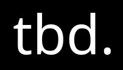

<p align="center"><a target="_blank" href="https://defi-statements-8hzeah.spheron.app/"></a></p>  
<p align="center">A “layer 2 sandbox” social network</p>
<p align="center">Application URL: https://tbd-ethprague.netlify.app/</p>

##### Table of Contents
- [Description](#description)
    * [Problem](#problem)
    * [Features](#features)
- [Further improvements](#further-improvements)
- [Build and deploy](#build-and-deploy)

## Description
A “layer 2 sandbox” social network. An open-source platform that allows users to import data from web2 social media APIs  (Twitter, Github, etc), and display it in the way they want. This means that they'll have a starting layout on which they can choose which API they want to link, but they'll also be able to trade layouts and skins with other users in form of NFTs.

### Problem
1. There’s not a social network for users in blockchain related space.
2. LinkedIn , the most popular solution is pretty limited:
* Hard to link and showcase external social networks (GitHub, twitter, facebook etc,).
* No good place to showcase achievements or projects
Little to no control of how your profile could look like

### Features
The project allows:
* To build your profile/CV with all the data you see relevant
* Track, add and import badges/achievements (For example NFTs of proof of assistance).
* Code your own layouts or components and use them or sell them on a marketplace.

## Further improvements
* Group pages
* Validating imported NFTs (for example recognize one received during hackathons)
* Marketplace. Trade layouts.
* Profile customization
* Provide a UI to mint achievements
* Store some of the user data on-chain
* POAP integration

## Build and deploy

Install dependencies:
```shell
yarn
```
Run local:
```shell
yarn dev
```